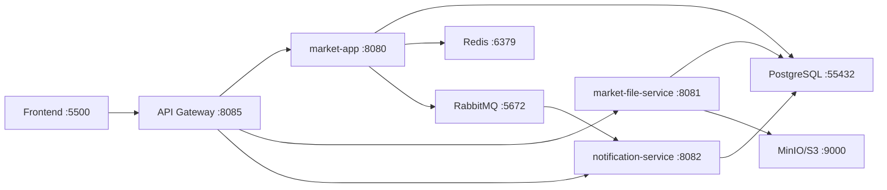

# NOVA Market Fullstack

Practice marketplace project with microservice-style routing, asynchronous notifications, cache, payments and API documentation.

- `frontend` - static NOVA Market frontend
- `api-gateway` - Spring Cloud Gateway entry point, route layer and request-id logging
- `market-app` - Java 21 Spring Boot backend with products, categories, auth, orders, Redis cache, RabbitMQ events and payment transaction
- `market-file-service` - Java 21 Spring Boot file service with MinIO/S3 storage
- `notification-service` - Java 21 Spring Boot service that consumes RabbitMQ order events and stores them in `notification_events`

## Architecture



## Run With One Docker Compose

The full stack can be started from the repository root:

```bash
cd /Users/armatislambekov/Desktop/nova-market-fullstack
docker compose up -d --build
```

Open:

- Frontend: http://localhost:5500/index.html
- Admin panel: http://localhost:5500/index.html#manage
- API Gateway health: http://localhost:8085/actuator/health
- Market API through gateway: http://localhost:8085/api/categories
- User orders cache endpoint through gateway: http://localhost:8085/api/users/5/orders
- File API through gateway: http://localhost:8085/api/files
- Notification events through gateway: http://localhost:8085/api/notifications
- RabbitMQ: http://localhost:15673 (`guest` / `guest`)
- MinIO console: http://localhost:9011 (`minioadmin` / `minioadmin`)

Docker Compose exposes infrastructure on conflict-free host ports:

- PostgreSQL: `localhost:55433`
- Redis: `localhost:6380`
- RabbitMQ AMQP/UI: `localhost:5673` / `localhost:15673`
- MinIO API/console: `localhost:9010` / `localhost:9011`

Stop everything:

```bash
docker compose down
```

## Run Manually

Start PostgreSQL, MinIO, Redis and RabbitMQ:

```bash
cd market-app
docker compose up -d
```

Start backend:

```bash
cd market-app
JAVA_HOME=/Users/armatislambekov/Library/Java/JavaVirtualMachines/ms-21.0.11/Contents/Home mvn spring-boot:run
```

Start file service:

```bash
cd market-file-service
JAVA_HOME=/Users/armatislambekov/Library/Java/JavaVirtualMachines/ms-21.0.11/Contents/Home mvn spring-boot:run
```

Start notification service:

```bash
cd notification-service
JAVA_HOME=/Users/armatislambekov/Library/Java/JavaVirtualMachines/ms-21.0.11/Contents/Home mvn spring-boot:run
```

Start API gateway:

```bash
cd api-gateway
JAVA_HOME=/Users/armatislambekov/Library/Java/JavaVirtualMachines/ms-21.0.11/Contents/Home mvn spring-boot:run
```

Start frontend:

```bash
cd frontend
python3 -m http.server 5500
```

Open:

- Frontend: http://localhost:5500/index.html
- Admin panel: http://localhost:5500/index.html#manage
- API Gateway: http://localhost:8085
- Market API through gateway: http://localhost:8085/api/categories
- User orders cache endpoint through gateway: http://localhost:8085/api/users/5/orders
- File API through gateway: http://localhost:8085/api/files
- Notification events through gateway: http://localhost:8085/api/notifications
- RabbitMQ: http://localhost:15672 (`guest` / `guest`)
- MinIO console: http://localhost:9001

## Swagger / OpenAPI

Each backend service exposes Swagger UI:

- API Gateway docs: http://localhost:8085/swagger-ui.html
- Market API docs: http://localhost:8080/swagger-ui.html
- File Service docs: http://localhost:8081/swagger-ui.html
- Notification Service docs: http://localhost:8082/swagger-ui.html

OpenAPI JSON endpoints:

- http://localhost:8080/v3/api-docs
- http://localhost:8081/v3/api-docs
- http://localhost:8082/v3/api-docs
- http://localhost:8085/v3/api-docs

## Request Id Logging

`api-gateway` adds or forwards the `X-Request-Id` header for every request.

Example:

```bash
curl -i http://localhost:8085/api/categories
```

The response includes `X-Request-Id`, and gateway logs print the same value:

```text
INFO [requestId:...] GET /api/categories routed with request id ...
```

Admin account:

```text
admin@nova.kz
admin123
```

Customer account:

```text
qwerty@gmail.com
qwerty
```

## Practice Requirements Covered

- Notification events after order create/update/delete through RabbitMQ.
- `notification-service` saves events to `notification_events`.
- `api-gateway` routes frontend/API traffic to `market-app`, `market-file-service`, and `notification-service`.
- Swagger/OpenAPI documentation is available for services.
- Root Docker Compose can start the complete stack.
- API Gateway adds request-id logging for easier tracing.
- Redis cache for `GET /api/users/{userId}/orders`.
- Cache eviction after order create/update/delete and payment.
- Payment entity linked to order.
- `POST /api/orders/{orderId}/payments` is transactional.
- Double payment is blocked with locking and a unique constraint.
